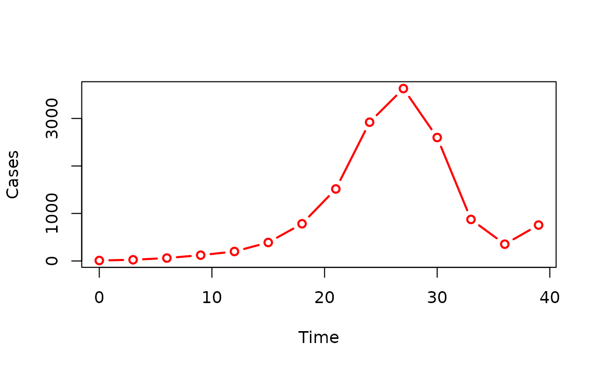

# Getting started with epichains

This vignette demonstrates how get started with using the *epichains*
package for simulating transmission chains or estimating the likelihood
of observing a transmission chain.

- To understand the theoretical background of the branching processes
  methods used here, refer to the theory vignette
  [`vignette("theoretical_background")`](https://epiverse-trace.github.io/epichains/dev/articles/theoretical_background.md).
- To understand the software development design decisions and
  implementation details of the package, refer to the design vignette
  [`vignette("design-principles")`](https://epiverse-trace.github.io/epichains/dev/articles/design-principles.md).

Infectious disease epidemics spread through populations when a chain of
infected individuals transmit the infection to others. [Branching
processes](https://en.wikipedia.org/wiki/Branching_process) can be used
to model this process. A branching process is a stochastic process where
each infectious individual in a generation gives rise to a random number
of individuals in the next generation, starting with the index case in
generation 1. The distribution of the number of offspring is called the
offspring distribution.

The size of the transmission chain is the total number of individuals
infected by a single case, and the length of the transmission chain is
the number of generations from the first case to the last case they
produced before the chain ended. The size calculation includes the first
case and the length calculation includes the first generation when the
first case starts the chain (See figure below).

![The figure shows an example of a transmission chain starting with a
single case C1. The complete chain is depicted as blue circles linked by
orange directed arrows showing the cases produced in each generation.
Each generation is marked by a brown rectangle and labelled Gen 1, Gen
2, and Gen 3. The chain grows through generations Gen 1, Gen 2, and Gen
3. Case C1 starts in Gen 1 and produces cases C2, and C3 in Gen 2. In
Gen 3, C2 produces C4 and C5, and C3 produces C6. The chain ends in Gen
3. The chain size of C1 is 6, which includes C1 (that is the sum of all
the blue circles, representing cases) and the length is 3, which
includes Gen 1 (maximum number of generations reached by C1's
chain).](img/transmission_chain_example.png)

An example of a transmission chain starting with a single case C1. Cases
are represented by blue circles and arrows indicate who infected whom.
The chain grows through generations Gen 1, Gen 2, and Gen 3, producing
cases C2, C3, C4, C5, and C6. The chain ends at generation Gen 3 with
cases C4, C5, and C6. The size of C1’s chain is 6, including C1 (that
is, the sum of all blue circles) and the length is 3, which includes Gen
1 (maximum number of generations reached by C1’s chain).

*epichains* provides methods to analyse and simulate the size and length
of branching processes with an arbitrary offspring distribution. These
can be used, for example, to analyse the distribution of chain sizes or
length of infectious disease outbreaks, as discussed in Farrington,
Kanaan, and Gay ([2003](#ref-farrington2003)) and Blumberg and
Lloyd-Smith ([2013](#ref-blumberg2013)).

``` r
library("epichains")
library("epicontacts")
```

## Transmission chains likelihoods

### Use case

Suppose we have observed a number of transmission chains, each arising
from a separate index case. What are the likely transmission properties
(reproduction number and/or superspreading coefficient) that generated
these chains (assuming these parameters are the same across all the
chains)?

The first step in answering this question is to calculate the likelihood
of observing the observed chain summaries given the transmission
properties. This is where the
[`likelihood()`](https://epiverse-trace.github.io/epichains/dev/reference/likelihood.md)
function comes in. The returned estimate can then be used to infer the
transmission properties using estimation frameworks such as maximum
likelihood or Bayesian inference.

*epichains* does not provide these estimation frameworks.

#### What we have

1.  Data on observed transmission chains summaries (sizes or lengths).

#### What we assume

1.  An offspring distribution that governs the number of secondary cases
    produced by each case.
2.  Parameters of the offspring distribution (for example, mean and
    overdispersion if using a negative binomial; which can then be
    interpreted as reproduction number and superspreading coefficient,
    respectively)
3.  (optional) An observation process/probability that generates the
    observed chain summaries.
4.  (optional) A threshold of chain summaries that are considered too
    large to be consistent with a reproduction number of \\R\<1\\ (e.g.,
    \\N\\ cases or \\T\\ generations in total).

### [`likelihood()`](https://epiverse-trace.github.io/epichains/reference/likelihood.html)

This function calculates the likelihood/loglikelihood of observing a
vector of outbreak summaries obtained from transmission chains.
“Outbreak summaries” here refer to transmission chain sizes or
lengths/durations.

[`likelihood()`](https://epiverse-trace.github.io/epichains/dev/reference/likelihood.md)
requires a vector of chain summaries (sizes or lengths), `chains`, the
corresponding statistic to use, `statistic`, the offspring distribution,
`offspring_dist` and its associated parameters.

`offspring_dist` is specified by the R function that is used to generate
random numbers, i.e. `rpois` for Poisson, `rnbinom` for negative
binomial, or a custom function.

By default, the result is a log-likelihood but if `log = FALSE`, then
likelihoods are returned (See
[`?likelihood`](https://epiverse-trace.github.io/epichains/dev/reference/likelihood.md)
for more details).

To understand how
[`likelihood()`](https://epiverse-trace.github.io/epichains/dev/reference/likelihood.md)
works see the section on [How `likelihood()`
works](#how-likelihood-works).

Let’s look at the following example where we estimate the log-likelihood
of observing `chain_sizes`.

``` r
set.seed(121)
# example of observed chain sizes
# randomly generate 20 chains of size between 1 to 10
chain_sizes <- sample(1:10, 20, replace = TRUE)
chain_sizes
#>  [1]  4  7  4  9  1  3  7  5  1  8 10  2  1  2  4  5 10  6  8  7
# estimate loglikelihood of the observed chain sizes for given lambda
likelihood_eg <- likelihood(
  chains = chain_sizes,
  statistic = "size",
  offspring_dist = rpois,
  nsim_obs = 100,
  lambda = 0.5
)
# Print the estimate
likelihood_eg
#> [1] -67.82879
```

### Joint and individual log-likelihoods

[`likelihood()`](https://epiverse-trace.github.io/epichains/dev/reference/likelihood.md),
by default, returns the joint log-likelihood, given by the sum of
log-likelihoods of each observed chain. If instead the individual
log-likelihoods are desired (for example for calculating
[Watanabe–Akaike information
criterion](https://en.wikipedia.org/wiki/Watanabe%E2%80%93Akaike_information_criterion)
values, then the `individual` argument must be set to `TRUE`. To return
likelihoods instead, set `log = FALSE`.

``` r
set.seed(121)
# example of observed chain sizes
# randomly generate 20 chains of size between 1 to 10
chain_sizes <- sample(1:10, 20, replace = TRUE)
chain_sizes
#>  [1]  4  7  4  9  1  3  7  5  1  8 10  2  1  2  4  5 10  6  8  7

# estimate loglikelihood of the observed chain sizes
likelihood_ind_eg <- likelihood(
  chains = chain_sizes,
  statistic = "size",
  offspring_dist = rpois,
  nsim_obs = 100,
  lambda = 0.5,
  individual = TRUE
)
# Print the estimate
likelihood_ind_eg
#> [[1]]
#>  [1] -3.098612 -4.508584 -3.098612 -5.269208 -0.500000 -2.480829 -4.508584
#>  [8] -3.622329 -0.500000 -4.900542 -5.619471 -1.693147 -0.500000 -1.693147
#> [15] -3.098612 -3.622329 -5.619471 -4.086190 -4.900542 -4.508584
```

### Observation probability

[`likelihood()`](https://epiverse-trace.github.io/epichains/dev/reference/likelihood.md)
uses the argument `obs_prob` to model the observation probability.

By default, it assumes perfect observation, where `obs_prob = 1` (See
[`?likelihood`](https://epiverse-trace.github.io/epichains/dev/reference/likelihood.md)),
meaning that all transmission events are observed and recorded in the
data.

If observations are imperfect, the `obs_prob` must be less than 1. In
the case of imperfect observation, “true” chain sizes or lengths are
simulated `nsim_obs` times, and the likelihood calculated for each of
the simulations.

For example, if the probability of observing each case is
`obs_prob = 0.30`, we use

``` r
set.seed(121)
# example of observed chain sizes; randomly generate 20 chains of size 1 to 10
chain_sizes <- sample(1:10, 20, replace = TRUE)
# get their likelihood
liks <- likelihood(
  chains = chain_sizes,
  statistic = "size",
  offspring_dist = rpois,
  obs_prob = 0.3,
  lambda = 0.5,
  nsim_obs = 10
)
liks
#>  [1] -183.8670 -162.1382 -166.6720 -170.1077 -152.9557 -157.9814 -166.0587
#>  [8] -174.8488 -156.4197 -160.0229
```

This returns `10` likelihood values (because `nsim_obs = 10`), which can
be averaged to come up with an overall likelihood estimate.

### How `likelihood()` works

[`likelihood()`](https://epiverse-trace.github.io/epichains/dev/reference/likelihood.md)
first checks if an analytical solution of the likelihood exists for the
given offspring distribution and chain statistic specified. If there’s
none, simulations are used to estimate the likelihoods.

The *epichains* package includes closed-form (analytical) solutions for
calculating the likelihoods associated with certain summaries of
transmission chains (“size” or “length”) for specific offspring
distributions.

For the size distributions, the package provides the Poisson, negative
binomial, and gamma-borel mixture.

To provide the gamma-Borel size likelihood, the [Borel
distribution](https://en.wikipedia.org/wiki/Borel_distribution) is
needed. However, base R does not provide this distribution natively like
poisson and gamma, so *epichains* provides its [density and random
generator](https://epiverse-trace.github.io/epichains/reference/index.html#special-distributions).

For the length distribution, there’s the Poisson and geometric
distributions. These can be used with
[`likelihood()`](https://epiverse-trace.github.io/epichains/dev/reference/likelihood.md)
based on what is specified for `offspring_dist` and `statistic`.

If an analytical solution does not exist, an internal simulation
function,
[`.offspring_ll()`](https://epiverse-trace.github.io/epichains/dev/reference/dot-offspring_ll.md)
is employed. It uses simulations to approximate the probability
distributions ([using a linear approximation to the cumulative
distribution](https://en.wikipedia.org/wiki/Empirical_distribution_function)
for unobserved sizes/lengths). If simulation is to be used, an extra
argument `nsim_offspring` must be passed to
[`likelihood()`](https://epiverse-trace.github.io/epichains/dev/reference/likelihood.md)
to specify the number of simulations to be used for this approximation.
Approximate values of the likelihood will vary with every call to the
simulation (because the simulations used for estimation vary), and it
may be worth calling
[`likelihood()`](https://epiverse-trace.github.io/epichains/dev/reference/likelihood.md)
multiple times in this case to see the error this may introduce.

For example, let’s look at an example where `chain_sizes` is observed
and we want to calculate the likelihood of this being drawn from a
binomial distribution with probability `prob = 0.9`.

``` r
set.seed(121)
# example of observed chain sizes; randomly generate 20 chains of size 1 to 10
chain_sizes <- sample(1:10, 20, replace = TRUE)
# get their likelihood
liks <- likelihood(
  chains = chain_sizes,
  offspring_dist = rbinom,
  statistic = "size",
  size = 1,
  prob = 0.9,
  nsim_offspring = 250
)
liks
#> [1] -56.76805
```

## Transmission chain simulation

### Use case

We want to simulate a scenario where a number of chains are each
produced by a separate index case. We want to simulate the chains of
transmission that result from these cases, given a specific offspring
distribution and a reproduction number.

#### What we have

1.  An initial number of cases that seed the outbreak.

#### What we assume

1.  An offspring distribution that governs the number of secondary cases
    produced by each case.
2.  Parameters of the offspring distribution (for example, mean and
    overdispersion if using a negative binomial; which can then be
    interpreted as reproduction number and superspreading coefficient,
    respectively)
3.  (optional) A threshold of chain summaries that are considered too
    large to be consistent with a reproduction number of \\R\<1\\ (e.g.,
    \\N\\ cases or \\T\\ generations in total).
4.  (optional) A generation time distribution that governs the time
    between successive cases.

There are two simulation functions, herein referred to collectively as
the `simulate_*()` functions that can help us achieve this.

### [`simulate_chains()`](https://epiverse-trace.github.io/epichains/reference/simulate_chains.html)

[`simulate_chains()`](https://epiverse-trace.github.io/epichains/dev/reference/simulate_chains.md)
simulates an outbreak from a given number of infections and an offspring
distribution. By default, it assumes the population is infinite with no
pre-existing immunity.

The function tracks and returns information on infectors (ancestors),
infectees, the generation of infection, and the time, if a generation
time function is specified.

Let’s look at an example where we simulate a transmission tree for
\\10\\ index cases. We assume a poisson offspring distribution with
mean, \\\text{lambda} = 0.9\\, and a generation time of \\3\\ days:

``` r
set.seed(32)
# Define generation time
generation_time_fn <- function(n) {
  gt <- rep(3, n)
  return(gt)
}

sim_chains <- simulate_chains(
  n_chains = 10,
  statistic = "size",
  offspring_dist = rpois,
  stat_threshold = 10,
  generation_time = generation_time_fn,
  lambda = 0.9
)

head(sim_chains)
#>    chain infector infectee generation time
#> 11     1        1        2          2    3
#> 12     2        1        2          2    3
#> 13     3        1        2          2    3
#> 14     3        1        3          2    3
#> 15     4        1        2          2    3
#> 16     6        1        2          2    3
```

By default,
[`simulate_chains()`](https://epiverse-trace.github.io/epichains/dev/reference/simulate_chains.md)
assumes an infinite population but can account for susceptible depletion
when a finite `pop` is specified.

Pre-existing immunity levels can also be specified, which will be
applied to `pop` before the simulation is initialised.

Here is a quick example where we simulate an outbreak in a population of
size \\1000\\ with \\10\\ index cases and \\10/%\\ pre-existing
immunity. We assume individuals have a poisson offspring distribution
with mean, \\\text{lambda} = 1\\, and fixed generation time of \\3\\:

``` r
set.seed(32)
# Define generation time
generation_time_fn <- function(n) {
  gt <- rep(3, n)
  return(gt)
}

sim_chains_with_pop <- simulate_chains(
  pop = 1000,
  n_chains = 10,
  percent_immune = 0.1,
  offspring_dist = rpois,
  statistic = "size",
  lambda = 1,
  generation_time = generation_time_fn
)

head(sim_chains_with_pop)
#>    chain infector infectee generation time
#> 11     1        1        2          2    3
#> 12     2        1        2          2    3
#> 13     3        1        2          2    3
#> 14     3        1        3          2    3
#> 15     4        1        2          2    3
#> 16     6        1        2          2    3
```

### [`simulate_chain_stats()`](https://epiverse-trace.github.io/epichains/reference/simulate_chain_stats.html)

[`simulate_chain_stats()`](https://epiverse-trace.github.io/epichains/dev/reference/simulate_chain_stats.md)
is a performant version of
[`simulate_chains()`](https://epiverse-trace.github.io/epichains/dev/reference/simulate_chains.md)
that does not track information on each infector and infectee. It
returns the eventual size or length/duration of each transmission chain.
This function is especially useful for calculating numerical likelihoods
in
[`likelihood()`](https://epiverse-trace.github.io/epichains/dev/reference/likelihood.md).

Here is an example to simulate the previous examples without
intervention, returning the size of each of the \\10\\ chains. It
assumes a Poisson offspring distribution distribution with mean of
\\0.9\\.

``` r
set.seed(123)

simulate_chain_stats_eg <- simulate_chain_stats(
  n_chains = 10,
  statistic = "size",
  offspring_dist = rpois,
  stat_threshold = 10,
  lambda = 0.9
)

# Print the results
simulate_chain_stats_eg
#> `epichains_summary` object 
#> 
#>  [1]   1 Inf   4   4 Inf   1   2 Inf   5   3
#> 
#>  Simulated sizes: 
#> 
#> Max: >=10
#> Min: 1
```

## S3 Methods

### Summarising

You can run [`summary()`](https://rdrr.io/r/base/summary.html) on the
object returned by
[`simulate_chains()`](https://epiverse-trace.github.io/epichains/dev/reference/simulate_chains.md)
to obtain the chain summaries per index case.

``` r
set.seed(32)
# Define generation time
generation_time_fn <- function(n) {
  gt <- rep(3, n)
  return(gt)
}

sim_chains <- simulate_chains(
  n_chains = 10,
  statistic = "size",
  offspring_dist = rpois,
  stat_threshold = 10,
  generation_time = generation_time_fn,
  lambda = 0.9
)

summary(sim_chains)
#> `epichains_summary` object 
#> 
#>  [1] Inf   2 Inf   2   1 Inf   3 Inf   9   1
#> 
#>  Simulated sizes: 
#> 
#> Max: >=10
#> Min: 1

# Example with simulate_chain_stats()
set.seed(32)

simulate_chain_stats_eg <- simulate_chain_stats(
  n_chains = 10,
  statistic = "size",
  offspring_dist = rpois,
  stat_threshold = 10,
  lambda = 0.9
)

# Get summaries
summary(simulate_chain_stats_eg)
#> $n_chains
#> [1] 10
#> 
#> $max_stat
#> [1] Inf
#> 
#> $min_stat
#> [1] 1
```

This summary is the same as the output of
[`simulate_chain_stats()`](https://epiverse-trace.github.io/epichains/dev/reference/simulate_chain_stats.md)
if the same inputs are used.
[`simulate_chain_stats()`](https://epiverse-trace.github.io/epichains/dev/reference/simulate_chain_stats.md)
is a more performant version of
[`simulate_chains()`](https://epiverse-trace.github.io/epichains/dev/reference/simulate_chains.md),
hence, you can use it instead, if you are only interested in the summary
of the simulated chains without details about the infection tree. :::

We can confirm if the two outputs are the same using
[`base::setequal()`](https://rdrr.io/r/base/sets.html), which checks if
two objects are equal and returns `TRUE/FALSE`.

``` r
setequal(
  # summary of output from simulate_chains()
  summary(sim_chains),
  # results from simulate_chain_stats()
  simulate_chain_stats_eg
)
#> [1] TRUE
```

### Aggregating

You can aggregate `<epichains_tree>` objects returned by
[`simulate_chains()`](https://epiverse-trace.github.io/epichains/dev/reference/simulate_chains.md)
a `<data.frame>` with columns “cases” and either “generation” or “time”,
depending on the value of `by`.

To aggregate over “time”, you must have specified a generation time
distribution (`generation_time`) in the simulation step.

``` r
# Example with simulate_chains()
set.seed(32)

# Define generation time
generation_time_fn <- function(n) {
  gt <- rep(3, n)
  return(gt)
}

sim_chains <- simulate_chains(
  n_chains = 10,
  statistic = "size",
  offspring_dist = rpois,
  stat_threshold = 10,
  generation_time = generation_time_fn,
  lambda = 0.9
)

aggregate(sim_chains, by = "time")
#>   time cases
#> 1    0    10
#> 2    3    12
#> 3    6    14
#> 4    9    17
#> 5   12     3
#> 6   15     4
#> 7   18     3
```

### Plotting

We can plot individual chains in an `<epichains>` object using the
[{epicontacts}
package](https://www.repidemicsconsortium.org/epicontacts/).

To do this, we first need to create an `<epicontacts>` object using the
[`epicontacts::make_epicontacts()`](https://www.repidemicsconsortium.org/epicontacts/reference/make_epicontacts.html)
function, which requires a linelist and a contacts data.frame (See
`?epicontacts::make_epicontacts()`).

### Some notes about interoperability between `<epicontacts>` and `<epichains>` objects

- For the
  [`epicontacts::make_epicontacts()`](https://www.repidemicsconsortium.org/epicontacts/reference/make_epicontacts.html)
  function to work:

  - the `linelist` and `contacts` data.frames must have a column named
    “id” that uniquely identifies each case.
  - The `linelist` and `contacts` objects can be the same.

- An `<epichains>` object contains multiple independent chains with
  their own unique infectee ids, so this does not work out of the box
  with
  [`make_epicontacts()`](https://www.repidemicsconsortium.org/epicontacts/reference/make_epicontacts.html)
  unless you use a subset chain.

- For now, we will have to select and visualise individual chains from
  the `<epichains>` object.

- In future versions of this package, we will make this interaction
  seamless by providing user-friendly functionality to convert an
  `<epichains>` object to an `<epicontacts>` in a way that allows us to
  plot all chains at once.

Let’s subset one of the chains with the biggest size from the
`sim_chains` object created above.

``` r
# Get the biggest chain
longest_chain <- sim_chains[sim_chains$chain == which.max(
  unname(table(sim_chains$chain))
), ]

# Convert to data.frame to view the whole data
as.data.frame(longest_chain)
#>    chain infector infectee generation time
#> 6      6       NA        1          1    0
#> 16     6        1        2          2    3
#> 17     6        1        3          2    3
#> 18     6        1        4          2    3
#> 27     6        2        5          3    6
#> 28     6        3        6          3    6
#> 29     6        3        7          3    6
#> 30     6        4        8          3    6
#> 42     6        5        9          4    9
#> 43     6        6       10          4    9
#> 44     6        7       11          4    9
#> 45     6        8       12          4    9
```

Now, we can plot the chain using the
[epicontacts](https://www.repidemicsconsortium.org/epicontacts/)
package.

``` r
# Create an `<epicontacts>` object
epc <- make_epicontacts(
  linelist = longest_chain,
  contacts = longest_chain,
  id = "infectee",
  from = "infector",
  to = "infectee",
  directed = TRUE
)

# Plot the chain
plot(epc)
```

Aggregated `<epichains_tree>` objects can also be plotted using base R
or `ggplot2` with little to no data manipulation.

Here is an end-to-end example from simulation through aggregation to
plotting.

``` r
# Run simulation with simulate_chains()
set.seed(32)
# Define generation time
generation_time_fn <- function(n) {
  gt <- rep(3, n)
  return(gt)
}

sim_chains <- simulate_chains(
  n_chains = 10,
  statistic = "size",
  offspring_dist = rpois,
  stat_threshold = 1000,
  generation_time = generation_time_fn,
  lambda = 2
)

# Aggregate cases over time
sim_chains_aggreg <- aggregate(sim_chains, by = "time")

# Plot cases over time
plot(
  sim_chains_aggreg,
  type = "b",
  col = "red",
  lwd = 2,
  xlab = "Time",
  ylab = "Cases"
)
```



## References

Blumberg, S., and J. O. Lloyd-Smith. 2013. “Comparing Methods for
Estimating R0 from the Size Distribution of Subcritical Transmission
Chains.” *Epidemics* 5 (3): 131–45.
<https://doi.org/10.1016/j.epidem.2013.05.002>.

Farrington, C. P., M. N. Kanaan, and N. J. Gay. 2003. “Branching Process
Models for Surveillance of Infectious Diseases Controlled by Mass
Vaccination.” *Biostatistics (Oxford, England)* 4 (2): 279–95.
<https://doi.org/10.1093/biostatistics/4.2.279>.
