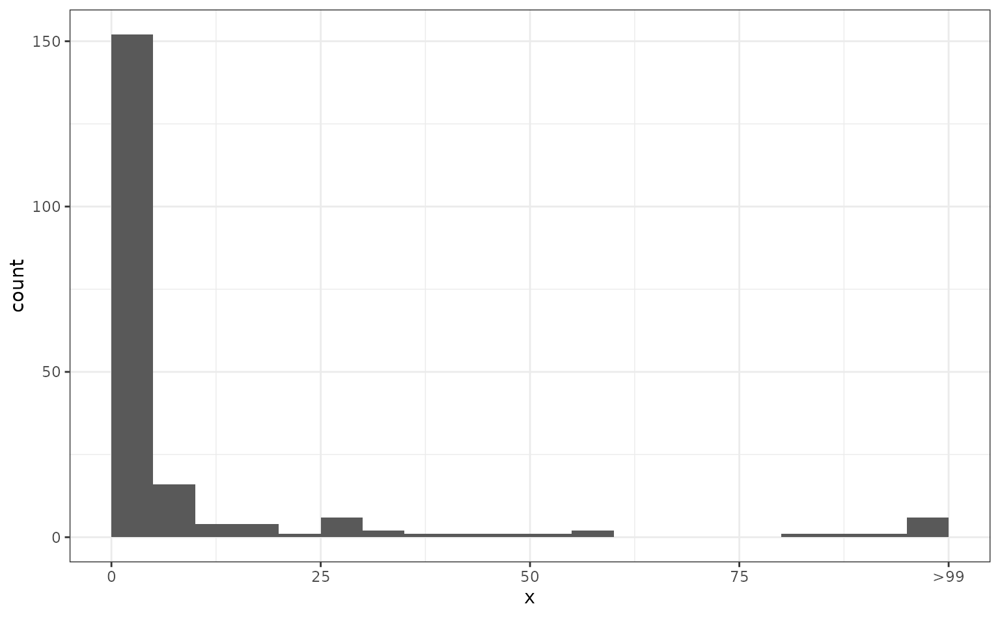

# Modelling disease control interventions

*epichains* does not provide any direct functionality for studying
reductions in transmission (e.g. from public health interventions).
However, the flexible simulation functionality that it includes can be
used to consider some specific changes to the parameters that can be
interpreted as the result of changes in social behaviour or control
measures. Here we investigate the effect on outbreak sizes, but the same
approaches could be used for investigating chain lengths (using the
`statistic` argument to
[`simulate_chain_stats()`](https://epiverse-trace.github.io/epichains/dev/reference/simulate_chain_stats.md))
or the time progression of outbreaks (using the
[`simulate_chains()`](https://epiverse-trace.github.io/epichains/dev/reference/simulate_chains.md)
function).

Some of the ideas presented here can be achieved using closed-form
solutions of the probability of an epidemic growing out of proportion or
going extinct, and the impact of heterogeneities in individual-level
transmission. For examples of this, see the [vignette on epidemic
risk](https://epiverse-trace.github.io/superspreading/articles/epidemic_risk.html)
in the
[superspreading](https://epiverse-trace.github.io/superspreading/index.html)
package, which is part of the Epiverse-TRACE Initiative.

``` r
## main package
library("epichains")
## for plotting
library("ggplot2")
## for truncating the offspring distribution later
library("truncdist")
```

As a base case we consider the spread of an infection with a negative
binomial offspring distribution with mean 1.2 and overdispersion
parameter 0.5. We simulate 200 chains tracking up to 99 infections:

``` r
sims <- simulate_chain_stats(
  n_chains = 200, offspring_dist = rnbinom, stat_threshold = 99, mu = 1.2,
  size = 0.5, statistic = "size"
)
```

We then plot the resulting distribution of chain sizes

``` r
sims[is.infinite(sims)] <- 100 # Replace infections > 99 with 100 for plotting.
ggplot(data.frame(x = sims), aes(x = x)) +
  geom_histogram(breaks = seq(0, 100, by = 5), closed = "left") +
  scale_x_continuous(
    breaks = c(0, 25, 50, 75, 100),
    labels = c(0, 25, 50, 75, ">99")
  ) +
  theme_bw()
```


## Reducing the strength of transmission

Following ([Lloyd-Smith et al. 2005](#ref-lloyd-smith2005)) we consider
two ways in which disease control interventions can reduce the
reproduction number: *population-wide* and *individual-specific*
control.

### Population-wide control

By population-level control we mean an intervention that reduces the
mean number of offspring (i.e. the reproduction number) by a fixed
proportion. For example, to reduce R by 25% at the population level we
scale the `mu` parameter from 1.2 to 0.9:

``` r
sims <- simulate_chain_stats(
  n_chains = 200, offspring_dist = rnbinom, stat_threshold = 99, mu = 0.9,
  size = 0.5, statistic = "size"
)
sims[is.infinite(sims)] <- 100 # Replace infections > 99 with 100 for plotting.
ggplot(data.frame(x = sims), aes(x = x)) +
  geom_histogram(breaks = seq(0, 100, by = 5), closed = "left") +
  scale_x_continuous(
    breaks = c(0, 25, 50, 75, 100),
    labels = c(0, 25, 50, 75, ">99")
  ) +
  theme_bw()
```



### Individual-level control.

In simulating population-level control we now apply the same reduction
as before (25%) but instead of assuming that the mean is reduced we
apply this such that 25% of individuals do not transmit further at all,
whereas the remaining 75% generate offspring as in the uncontrolled
case.

To do this, we can no longer use the standard negative binomial
distribution that comes with R. Instead, we define a random generator
from a modified negative binomial distribution that includes our
individual-level control as a `control` argument indicating the level of
individual-level control (0: no control; 1: full control):

``` r
rnbinom_ind <- function(n, ..., control = 0) {
  ## initialise number of offspring to 0
  offspring <- rep(0L, n)
  ## for each individual, decide whether they transmit further
  transmits <- rbinom(n = n, prob = 1 - control, size = 1)
  ## check if anyone transmits further
  if (any(transmits == 1L)) {
    ## for those that transmit, sample from negative binomial with given
    ## parameters
    offspring[which(transmits == 1L)] <- rnbinom(n = n, ...)
  }
  return(offspring)
}
```

Having defined this, we can generate simulations as before:

``` r
sims <- simulate_chain_stats(
  n_chains = 200, offspring_dist = rnbinom_ind, stat_threshold = 99, mu = 1.2,
  size = 0.5, control = 0.25, statistic = "size"
)
sims[is.infinite(sims)] <- 100 # Replace infections > 99 with 100 for plotting.
ggplot(data.frame(x = sims), aes(x = x)) +
  geom_histogram(breaks = seq(0, 100, by = 5), closed = "left") +
  scale_x_continuous(
    breaks = c(0, 25, 50, 75, 100),
    labels = c(0, 25, 50, 75, ">99")
  ) +
  theme_bw()
```


## Preventing superspreading events

Another way of controlling a disease would be to prevent individuals
from spreading to a large number of others, for example by preventing
mass gatherings or, more generally, settings where superspreading events
can occur.

We can model this by truncating the offspring distribution at a certain
size. This can be done, for example, using the
[truncdist](https://cran.r-project.org/package=truncdist) R package. We
use this to define a truncated negative binomial offspring distribution:

``` r
rnbinom_truncated <- function(n, ..., max = Inf) {
  return(rtrunc(n = n, spec = "nbinom", b = max, ...))
}
```

We use this to simulate chains in a situation where the maximum of
secondary cases that each infected person can generate is 10. This can
be likened to a disease control strategy where gatherings are limited to
10 people.

``` r
sims <- simulate_chain_stats(
  n_chains = 200, offspring_dist = rnbinom_truncated, stat_threshold = 99,
  mu = 1.2, size = 0.5, max = 10, statistic = "size"
)
sims[is.infinite(sims)] <- 100 # Replace infections > 99 with 100 for plotting.
ggplot(data.frame(x = sims), aes(x = x)) +
  geom_histogram(breaks = seq(0, 100, by = 5), closed = "left") +
  scale_x_continuous(
    breaks = c(0, 25, 50, 75, 100),
    labels = c(0, 25, 50, 75, ">99")
  ) +
  theme_bw()
```


## Truncating the generation interval

Lastly, we consider a situation where the generation interval is
shortened. We do not model this explicitly but instead consider the
effect on the offspring distribution.

For example, if our generation interval is from a gamma distribution
with shape = 25 and rate = 5 (corresponding to a mean of 5 and standard
deviation of 1), and we stop all transmission that would normally occur
more than 6 days after infection, we can calculate the proportion of
transmissions that are prevented as

``` r
control <- 1 - pgamma(6, shape = 25, rate = 5)
signif(control, 2)
#> [1] 0.16
```

In other words, this would prevent 16% of infections in this example.
The value of `control` can be used in the examples above to study the
effect on outbreak sizes.

## References

Lloyd-Smith, J. O., S. J. Schreiber, P. E. Kopp, and W. M. Getz. 2005.
“Superspreading and the Effect of Individual Variation on Disease
Emergence.” *Nature* 438 (7066): 355–59.
<https://doi.org/10.1038/nature04153>.
